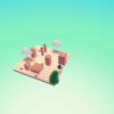

[Home](..)/[Resources](.)/Area, Perimeter, and Volume

## Area, Perimeter, and Volume
  

* [Lesson 3: Area, Perimeter, and Volume](6_Kodu_Curriculum_Math_Module.pdf#page=19)
* Student Ages: 8-14 years old
* Activity Time: 50 minutes 
* Activity Level: Beginner Coder

### Prerequisites
* Download and Installation of Kodu
* [Lesson 1: Growing Squares](growing_squares)
* [Lesson 2: Length, Width, Area, and Perimeter](length_width_area_and_perimeter)
* Lesson 3: Print Curriculum Guide:  
  * Student Activity: [Area and Perimeter](6_Kodu_Curriculum_Math_Module.pdf#page=28) (1 per student)
  * Student Activity: [Area and Perimeter](6_Kodu_Curriculum_Math_Module.pdf#page=27) (Teacher Key) 

### Learning Objectives
* Students will describe the property with the appropriate standard units when given a measure of length, width, height, surface area, perimeter, and volume.
* Students will demonstrate computational fluency, by using the associative property of multiplication when calculating the volume of a three-dimensional quadrilateral.
* Students will determine the shape's area and volume when given an irregular shape.

### Contents
* [Activator](#activator)
* [Units](#units)
* [Area and Perimeter](#area)
* [Conclusion](#conclusion)

### Student Activities

[**Activator**](6_Kodu_Curriculum_Math_Module.pdf#page=25) 
Students will display the following shape properties. Students will write the unit used to measure each property.
*Subjects: Math, Computer Science, Digital Technology, Engineering, 21st Century Learning*

[**Units**](6_Kodu_Curriculum_Math_Module.pdf#page=25) 
Students will display a 3D quadrilateral in Kodu. Students will learn that a 3D square is cube, while the proper term for a 3D rectangle is rectangular cuboid. Students will learn that length, width, height, and perimeter can be measured in meters, where one unit is one meter (m). Students learn that the area is measured in m2 because there are two numbers used to calculate it (length and width). Students learn that volume is measured in m3 because there are three numbers used to calculate it (length, width, and height). Students create and display a shape such as a 4 x 6 x 2 island in Kodu. Students identify the different parts of the shape and calculate the length, width, height, area, surface area, perimeter, and volume of the object.
*Subjects: Subjects: Math, Computer Science, Digital Technology, Engineering, 21st Century Learning*

[**Area and Perimeter**](6_Kodu_Curriculum_Math_Module.pdf#page=25) 
Students will create a 2 x 2 square in Kodu. Students will respond with the area and the perimeter. Students complete the Student Activity: [Area and Perimeter](6_Kodu_Curriculum_Math_Module.pdf#page=28). 
*Subjects: Subjects: Math, Computer Science, Digital Technology, Engineering, 21st Century Learning*

[**Conclusion**](6_Kodu_Curriculum_Math_Module.pdf#page=26) 
Students discuss how measurements are affected when one attribute to be measured is held constant and another is changed. Students respond to the guided questions about the measurements and the shapes in the world. 
*Subjects: Subjects: Math, Computer Science, Digital Technology, Engineering, 21st Century Learning*

### Performance Expectations
[**Assessment**](6_Kodu_Curriculum_Math_Module.pdf#page=21) 
Students will complete the Student Activity: [Area and Perimeter](6_Kodu_Curriculum_Math_Module.pdf#page=23). Students will create shapes in Kodu and calculate the area of the top surface and the perimeter of each shape. Students will discover that while area of the shapes stays the same, the perimeter changes. Students explore the different objects in Kodu by placing them in the areas created. 

### Skills
Character,
Citizenship,
Collaboration,
Communication,
Creativity,
Critical Thinking,
Project Based Learning

