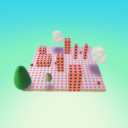

[Home](..)/[Resources](.)/Double the Items

## Double the Items, Double the Time?
  

* Lesson 8: Double the Items, Double the Time?
* Student Ages: 8-14 years old
* Activity Time: 50 minutes 
* Activity Level: Beginner Coder

### Prerequisites
* Download and Installation of Kodu
* [Lesson 1: Growing Squares](growing_squares)
* [Lesson 2: Length, Width, Area, and Perimeter](length_width_area_and_perimeter)
* [Lesson 3: Area, Perimeter, and Volume](area_perimeter_and_volume)
* [Lesson 4: Surface Area and Volume](surface_area_and_volume)  
* [Lesson 5: Obstacle Course](obstacle_course)
* [Lesson 6: Placing and Programming Items](placing_and_programming_items)
* [Lesson 7: Timing and Winning](timing_and_winning)
* Lesson 8: Student Activity
  * Kodu Obstacle Course Demo World (Kodu File)
* Lesson 8: Student Activity:
  * Double the Items (Print 1 per student)
  * Cannon and Rock (Kodu file)

### Learning Objectives
* Students will design an investigation to determine the effect on the time it takes to complete the retrieval of the items.
* Students will code their own specific actions by using the template as an example.

### Contents
* [Activator](#activator)
* [Creating Obstacle Course Version 2](#creating)
* [Creative Programming using a Template](#programming)

### Student Activities

[**Activator**](6_Kodu_Curriculum_Math_Module.pdf#page=51) 
Students will review how to calculate the average of number sets.
*Subjects: Math, Computer Science, Digital Technology, Engineering, 21st Century Learning*

[**Creating Obstacle Course Version 2**](6_Kodu_Curriculum_Math_Module.pdf#page=52) 
Students will open up their current game. Students will save their world, but give it a different name signifying the different version. Students will copy and paste the apples, repeating this until the number of items has doubled. Students should record the new items in their student activity sheet.
*Subjects: Subjects: Math, Computer Science, Digital Technology, Engineering, 21st Century Learning*

[**Creative Programming using a Template**](6_Kodu_Curriculum_Math_Module.pdf#page=52) 
Students will observe the teacher coding several actions. The first step by step teacher instructions includes coding When the Kodu bumps into a rock, the Kodu gets stunned. The second step by step teacher instructions includes a cannon wandering around the world. When the Kodu bumps into the cannon, the Kodu will explode and the game will end. Students will collaborate and discuss other actions/events that you would like to create in your worlds. Students will edit their worlds by using the examples learned in the demonstration.
*Subjects: Subjects: Math, Computer Science, Digital Technology, Engineering, 21st Century Learning*

### Performance Expectations
Student Activity - Double the Items. Students will create a second version of your obstacle course game that contains double the number of items. Students will place more items and record the locations in the table below.

### Skills
Character,
Citizenship,
Collaboration,
Communication,
Creativity,
Critical Thinking,
Project Based Learning