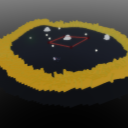

[Home](..)/[Resources](.)/Kodu Curriculum with Xbox Controller

## Kodu Curriculum with Xbox Controller
 

* [Module: Kodu Curriculum Xbox Controller](5_Kodu_Curriculum_Xbox_Controller.pdf)
* Student Ages: 9-14 years old
* Activity Time: 120 minutes
* Activity Level: Beginner Coder

### Prerequisites 
* Download and Installation of Kodu
* Xbox Controller

### Learning Objectives
* Introduction to programming, adding objects, animating characters, and creating landscape
* Creating landscape
* Using the controller to move characters, creating paths, setting behaviors
* Making clones and creatables and establishing a second player
* Changing behaviors using pages, establishing and shifting perspectives
* Power ups, health, timer
* Scoring basics and to communicate
* Starting unique stories and characters
* Presenting a game

### Contents
* [Kodu Curriculum Xbox Controller](5_Kodu_Curriculum_Xbox_Controller.pdf)
* [Kodu Curriculum Appendix](Kodu_Curriculum_Appendix.pdf)
* [World: Chaotic Orbitals (Complex movement from a few simple rules.)](https://worlds.kodugamelab.com/world/a27rHLswIEWezQLRWAa4Pw==)
* [World: Demo1 Cycle and Trees (Cycle always wanders and avoids trees)](https://worlds.kodugamelab.com/world/la0mN6apSEGGNGopgKY2Dg==)
* [World: Project Tedanoo](https://worlds.kodugamelab.com/world/3c277F14UU6TKeqQX0POJQ==)

### Student Activities
[Session 1: Basic Navigation and Kodu Principles](5_Kodu_Curriculum_Xbox_Controller.pdf#page=9) 
The students will navigate the Kodu macro environment using a Xbox Controller. The students will understand the foundational principles of programming. The students will access the programming mode of Kodu, potentially adjusting simple code for a specific purpose. 
*Subjects: Design Technology, Digital Literacy, 21st Century Learning Skills*

[Group Activity 1: Eating Apples](5_Kodu_Curriculum_Xbox_Controller.pdf#page=14) 
The students will add an object, change its color, select an object, and create a sequential program for an object. The students will load and play the world, Demo1. 
*Subjects: Design Technology, Digital Literacy, 21st Century Learning Skills*

[Session 2: Creating a Landscape](5_Kodu_Curriculum_Xbox_Controller.pdf#page=15) 
The teachers will ask for student volunteers to operate several of the landscape features. 
*Subjects: Design Technology, Digital Literacy, 21st Century Learning Skills*

[Session 2: Creating a Landscape](5_Kodu_Curriculum_Xbox_Controller.pdf#page=15) 
The teachers will ask for student volunteers to operate several of the landscape features. 
*Subjects: Design Technology, Digital Literacy, 21st Century Learning Skills*

[Team Activity 2](5_Kodu_Curriculum_Xbox_Controller.pdf#page=17) 
The students will work in teams to create the landscape features and create land with texture, add water, trees, rocks, etc. 
*Subjects: Design Technology, Digital Literacy, 21st Century Learning Skills*

[Session 3: Using Controller to Move Characters, Create Paths, and Set Behaviors](5_Kodu_Curriculum_Xbox_Controller.pdf#page=18) 
The teacher will use the Xbox controller to move characters in a game world. The teacher will show how to create a paths on which characters will move. The students will give objects behaviors. 
*Subjects: Design Technology, Digital Literacy, 21st Century Learning Skills*

[Student Activity 3](5_Kodu_Curriculum_Xbox_Controller.pdf#page=21) 
The students will use the Xbox controller to move characters in a game world. The students will create paths on which characters will move. The students will give objects behaviors. 
*Subjects: Design Technology, Digital Literacy, 21st Century Learning Skills*

[Session 4: Making Clones and Creatables](5_Kodu_Curriculum_Xbox_Controller.pdf#page=22) 
The teacher will demonstrate how to create a clone and creatable as well as demo how to create a two or more person game. 
*Subjects: Design Technology, Digital Literacy, 21st Century Learning Skills*

[Student Activity 4](5_Kodu_Curriculum_Xbox_Controller.pdf#page=22) 
The students will demonstrate an ability to create a clone, a creatable, and a two or more person game. 
*Subjects: Design Technology, Digital Literacy, 21st Century Learning Skills*

[Session 5: Starting Unique Stories and Characters](5_Kodu_Curriculum_Xbox_Controller.pdf#page=25) 
The students will discover the idea of pages, when they are used and why. The students will load and play the world, Vendura. 
*Subjects: Design Technology, Digital Literacy, 21st Century Learning Skills*

[Student Activity 5](5_Kodu_Curriculum_Xbox_Controller.pdf#page=28) 
The students will shift camera perspective, use close by and far away, implement shift in behavior using pages. 
*Subjects: Design Technology, Digital Literacy, 21st Century Learning Skills*

[Session 6: Mood and Tone](5_Kodu_Curriculum_Xbox_Controller.pdf#page=29) 
The students will understand the concept of timers, health monitors, and power ups. 
*Subjects: Design Technology, Digital Literacy, 21st Century Learning Skills*

[Session 7: Changing Behaviors Using Pages, Establishing, and Shifting Perspectives](5_Kodu_Curriculum_Xbox_Controller.pdf#page=32) 
The students will be able to understand the concept of scoring in a more complex way. 
*Subjects: Design Technology, Digital Literacy, 21st Century Learning Skills*

[Student Activity 7](5_Kodu_Curriculum_Xbox_Controller.pdf#page=33) 
The students will be able to use scoring in a more complex way. 
*Subjects: Design Technology, Digital Literacy, 21st Century Learning Skills*

[Session 8: Power Ups, Health, and Timer](5_Kodu_Curriculum_Xbox_Controller.pdf#page=34) 
The students will be able to showcase and share the games that they worked to create. 
*Subjects: Design Technology, Digital Literacy, 21st Century Learning Skills*

### Skills
Character,
Citizenship,
Collaboration,
Communication,
Creativity,
Critical Thinking,
Project Based Learning