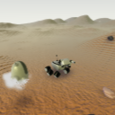

[Home](..)/[Resources](.)/Mars Mission Simulation

## Mars Mission Simulation
  

Learn to design a simulated Martian environment and program a Rover to explore Mars autonomously.

* [Lesson 3: Mars Mission Simulation](Level_3_Mars_Mission_Simulation_Lesson.pdf#page=11)
* Student Ages: 10-14 years old
* Activity Time: 1 week (300 minutes) 
* Activity Level: Beginner Coder

### Prerequisites
* Download and Installation of Kodu
* [Lesson 1: Search and Explore](search_and_explore_mars)
* [Lesson 2: Programming a Rover](programming_a_rover)
* Lesson 3: Print From Student Guide:  
  * [(A) Kodu Path Tool](Level_3_Mars_Mission_Simulation_Lesson.pdf#page=26)  (1 per student)
  * [(B) Kodu When Do Statements](Level_3_Mars_Mission_Simulation_Lesson.pdf#page=29) (1 per student)
  * [(C) Mars Mission Simulation Presentation](Level_3_Mars_Mission_Simulation_Lesson.pdf#page=32) (1 per student)
* Lesson 3: Print From Teacher Guide:
  * [(D) Mars Mission Simulation Rubric](Level_3_Mars_Mission_Simulation_Lesson.pdf#page=33)
  * [(E) Placement of Instructional Objective and Learning Outcomes in Taxonomy](Level_3_Mars_Mission_Simulation_Lesson.pdf#page=42)

### Learning Objectives
* Learn Space Science vocabulary
* Learn Computer Science vocabulary
* Learn about landing sites on Mars.
* Learn about creating 3D model on Martian terrain.
* Learn to program an exploration rover.
* Learn to produce simulations based on criteria and constraints.
* Learn to present simulations and rationale of the Mars project.

### Contents
* [Step 1 Engage: Mars Simulation](Level_3_Mars_Mission_Simulation_Lesson.pdf#page=11)
* [Step 2 Explore: Terrain Editing and Rover Programming](Level_3_Mars_Mission_Simulation_Lesson.pdf#page=12)
* [Step 3 Explain: Landforms and Rocks Explained](Level_3_Mars_Mission_Simulation_Lesson.pdf#page=18)
* [Step 4 Elaborate: Mars Mission Simulation](Level_3_Mars_Mission_Simulation_Lesson.pdf#page=20)
* [Step 5 Evaluate: Presentations](Level_3_Mars_Mission_Simulation_Lesson.pdf#page=23)

### Student Activities
[Step 1 Engage: Mars Simulation](Level_3_Mars_Mission_Simulation_Lesson.pdf#page=11) 
Students will be presented with a number of possible landing sites. Students will weigh the advantages and disadvantages of each site and support their decision for a particular site. Students will model the terrain at the site using Kodu’s terrain editing tools. Students will be scientists and engineers who are in the initial stages of designing a rover mission to Mars. They must first create a simulation of the landing site, the Martian terrain, and the activities that the rover will engage in while on Mars. Through the simulation, they will learn about the programming of a rover’s movement and actions, the landforms which make up Mars’ terrain, and the search for habitat on Mars. 
*Subjects:Science, Computer Science, Engineering, 21st Century Learning*

[Step 2 Explore: Terrain Editing and Rover Programming](Level_3_Mars_Mission_Simulation_Lesson.pdf#page=12) 
Students will choose landforms (crater, mountain, volcano, canyon, ancient riverbed/lake, etc.) to model. Students will show their understanding of how different types of rocks and minerals (volcanic, sedimentary) develop by selectively placing them at the different landforms. Students will explore and run the following World: "Mars Mission Simulation". Students work collaboratively with two to a computer and utilize a method called “pair programming.” One student will act as the “driver.” The driver is the only person to touch the keyboard and mouse or controller. The other student is the “navigator.” The navigator gives advice, instructs, and evaluates the pair’s progress. They should switch every 5 to 10 minutes throughout the class period to allow both students to perform the different roles. 
*Subjects:Science, Computer Science, Engineering, 21st Century Learning*

[Step 3 Explain: Landforms and Rocks Explained](Level_3_Mars_Mission_Simulation_Lesson.pdf#page=18) 
Students will learn that the rover relies on a set of computer commands from scientists and engineers on Earth, who plan its route to a place where they think they can make the most discoveries. The mission team tells the rover where to go, when to turn, and how to avoid hazards along its way by sending these complex plans via uplink through large communications antennas on Earth that send these daily instructions to the rover on Mars. Discuss how constructive and destructive forces, such as deposition and erosion, can create and change the landforms over time. Students collaborate to identify significant characteristics of particular landforms that they will model using Kodu’s terrain editing tools. 
*Subjects:Science, Computer Science, Engineering, 21st Century Learning*

[Step 4 Elaborate: Mars Mission Simulation](Level_3_Mars_Mission_Simulation_Lesson.pdf#page=20) 
Students will complete their simulation of a rover’s experiences on Mars. Students will research and select a landing site from four possible choices by completing the Curiosity Landing Site Selection. Students will model the landing site and surrounding areas in Kodu. Students will pick three additional landforms to model in the surrounding area. The landforms should be a mix of landforms where students may find volcanic or sedimentary rocks. Students will place volcanic and sedimentary rocks near the appropriate landforms. While these landforms may or may not actually exist near each other on Mars, the creation of the landforms gives students a chance to demonstrate their understanding of what the landforms look like and where they might find volcanic and sedimentary rocks. Students will design and program the rover’s movement and actions as it explores the newly created terrain. Students will act as the team of scientists and engineers who are tasked with deciding where the rover will go and what it will do every day. Students will translate their natural language procedure into Kodu's programming language.  Students will program the rover to perform an action on a rock along a path.  
*Subjects:Science, Computer Science, Engineering, 21st Century Learning*

### Performance Expectations
[Step 5 Evaluate: Presentations](Level_3_Mars_Mission_Simulation_Lesson.pdf#page=23) 
Use Sway or PowerPoint to demonstrate learning, students collaborative to present their work to the rest of the class. It is suggested that a central projector or monitor be used to present their Kodu worlds. Students will present their simulation and explain their rationale for the rover’s landing site, the landforms it encountered, and information about those landforms, what rock types it found, and how the rover was programmed. Students will complete the (C) Mars Mission Simulation Presentation worksheet. With the support of their worksheet answers, students will explain their rationale behind their decisions in their simulation.

### Skills
Character,
Citizenship,
Collaboration,
Communication,
Creativity,
Critical Thinking,
Project Based Learning

