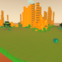

[Home](..)/[Resources](.)/Rapid Prototyping

## Rapid Prototyping
 

* [Week 2: Rapid Prototyping](PKDesignCourse_WeekTwo.pdf)
* Student Ages: 9-14 years old
* Activity Time: 60 minutes
* Activity Level: Beginner Coder

### Prerequisites 
* Download and Installation of Kodu
* [Getting Started with Kodu](getting_started_with_kodu)

### Learning Objectives
* Students will learn a more formal approach to game design.
* Students will learn to look at ideas, the iterative process, brainstorming skills, and identify risks.

### Contents
* [Rapid Prototyping](PKDesignCourse_WeekTwo.pdf)
* [Complete Game: Fusionoid](https://worlds.kodugamelab.com/world/JB_AMqu4Pk2_mQEICpgZvQ==) (The Clouds are overheating! Eat the icy blue Apples to cool them down - eat all of the Apples to win! Game over when yellow score reaches 20.)

### Student Activities
[Rapid Prototyping](PKDesignCourse_WeekTwo.pdf#page=2) 
Students will take a look at a game development approach that’s more formal, with clearly outlined steps designed to encourage you to consider your game design more broadly. 
*Subjects: Design Technology, Digital Literacy, 21st Century Learning Skills*

[Identifying Risks](PKDesignCourse_WeekTwo.pdf#page=5) 
Students will identity the major technical and design risks of a design. Students will learn the concept of building a prototype of the risks. Students will learn to test. Students will learn the concept of modifying (or abandoning) as needed. 
*Subjects: Design Technology, Digital Literacy, 21st Century Learning Skills*

[The 400 Project](PKDesignCourse_WeekTwo.pdf#page=6) 
Students will learn the concept of providing clear short-term goals. Students will learn rules that apply to Game Design. 
*Subjects: Design Technology, Digital Literacy, 21st Century Learning Skills*

[Design Patterns in Games](PKDesignCourse_WeekTwo.pdf#page=6) 
Students will learn that patterns are used by designers to solve problems using specific known solutions and that have been previously proven to work. 
*Subjects: Design Technology, Digital Literacy, 21st Century Learning Skills*

[Kodu Game Lab Recipes](PKDesignCourse_WeekTwo.pdf#page=8) 
Students will learn that Kodu allows them to modify or build upon existing games. Students will learn that Kodu allows them to to look at the code of any game and see how it was done. Students will learn that Kodu allows them to copy and paste code from one project to another. Students learn that Kodu has programming recipes to implement specific elements. 
*Subjects: Design Technology, Digital Literacy, 21st Century Learning Skills*

### Performance Expectations
[Week 2 Task]() 
Students will improve an an existing game such as the kodu world, Fusionoid. Or students will write a list of achievable requirements for the game first, perhaps a mission statement, make a few notes about the design, and then follow the iterative process outlined in this week’s course guide. 
*Subjects: Design Technology, Digital Literacy, 21st Century Learning Skills*

### Skills
Character,
Citizenship,
Collaboration,
Communication,
Creativity,
Critical Thinking,
Project Based Learning 

    