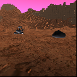

[Home](..)/[Resources](.)/Search and Explore Mars

## Search and Explore Mars
  

Learn to determine the most effective set of commands to navigate a Rover across terrain to collect scientific data.

* [Lesson 1: Search and Explore Mars](Level_1_Search_and_Explore_Mars.pdf)
* Student Ages: 10-14 years old
* Activity Time: 1 day (60 minutes) 
* Activity Level: Beginner Coder

### Prerequisites
* Download and Installation of Kodu
* Lesson 1: Print From Student Guide:  
  * [(A) Search and Explore Mars Evaluation](Level_1_Search_and_Explore_Mars.pdf#page=8) (1 per student)
* Lesson 1: Print From Teacher Guide:
  * [(B) Search and Explore Mars Rubric](Level_1_Search_and_Explore_Mars.pdf#page=9)
  * [(C) Placement of Instructional Objective and Learning Outcomes in Taxonomy](Level_1_Search_and_Explore_Mars.pdf#page=22)  

### Learning Objectives
* Learn Space Science vocabulary
* Learn Computer Science vocabulary
* Learn Earth Science concepts such as rocks' value.
* Learn to map and plan routes.
* Learn to program an exploration rover.
* Learn to produce simulations based on criteria and constraints
* Learn to present simulations and rationale of the Mars project.

### Contents
* [Step 1 Engage: A Rover Explores the Surface of Mars](Level_1_Search_and_Explore_Mars.pdf#page=10)
* [Step 2 Explore: Scientific Discovery Points](Level_1_Search_and_Explore_Mars.pdf#page=11)
* [Step 3 Explain: Rocks Have Different Scientific Significance in the Search for Habitats on Mars](Level_1_Search_and_Explore_Mars.pdf#page=12)
* [Step 4 Elaborate: Simulating How a Rover Receives a Set of Instructions](Level_1_Search_and_Explore_Mars.pdf#page=14)
* [Step 5 Evaluate: Reflect using the Search and Explore Mars Evaluation worksheet](Level_1_Search_and_Explore_Mars.pdf#page=16)

### Student Activities
[Step 1 Engage: A Rover Explores the Surface of Mars](Level_1_Search_and_Explore_Mars.pdf#page=10) 
Students will elicit other robotic vehicles, have students name other robotic vehicles, such as robotic drones used in surveillance or robotic submarine probes used to explore the deep ocean. Students brainstorm how a robotic vehicle like a Mars Rover might be controlled when no human is there to drive it. 
*Subjects:Science, Computer Science, Engineering, 21st Century Learning*

[Step 2 Explore: Scientific Discovery Points](Level_1_Search_and_Explore_Mars.pdf#page=11) 
Students will learn that scientists and engineers want to make the most discoveries possible as they explore the surface of Mars. Students will command the Rover to move to places that are scientifically interesting so that they can study them. Students will explore and run the following Kodu World: "Mars Rover: The Expedition." Students will make observations about the different landforms and where they find the different rock types. Students will work collaboratively to control the Rover and explore the world. 
*Subjects:Science, Computer Science, Engineering, 21st Century Learning*

[Step 3 Explain: Rocks Have Different Scientific Significance in the Search for Habitats on Mars](Level_1_Search_and_Explore_Mars.pdf#page=12) 
Students will learn the scientific definitions of rocks and minerals. Students will learn that two basic rock types are found on the surface of Mars: volcanic (igneous) rocks and sedimentary rocks. Students will place an igneous rock where they noticed other igneous rocks were most commonly found. Students will place sedimentary rocks where they were most commonly found. 
*Subjects:Science, Computer Science, Engineering, 21st Century Learning*

[Step 4 Elaborate: Simulating How a Rover Receives a Set of Instructions](Level_1_Search_and_Explore_Mars.pdf#page=14) 
Students will complete a puzzle. Students will learn that it takes about 8 – 20 minutes for a signal (message) to get to a Rover on Mars, and the same amount of time for any message to be returned. Also, no external camera systems are around on Mars to watch the Rover as it moves. Rover drivers on Earth must carefully plan the Rover’s path, making sure it doesn’t get into trouble (go over cliffs, get stuck in sand traps, run into a rock, etc.). Students will make predictions how can people from Earth can drive the Rover safely when they can’t see it. Students will also make predictions about how people from Earth can determine how a message was successfully sent.  Students learn that rather than being commanded in real-time, due to the delay it takes for a command to reach Mars, Rovers are controlled through a series of instructions in a program. Students review notecards and learn that the notecards represents uplink command from the scientists and engineers who determine the Rover's movement and the functions it will perform. Students will work collaboratively to role-play. One student will act as a member of the science and engineering team on Earth by reading commands, while another student will act the part of a Rover on Mars by following them. 
*Subjects:Science, Computer Science, Engineering, 21st Century Learning*

### Performance Expectations
[Step 5 Evaluate: Reflect using the Search and Explore Mars Evaluation worksheet](Level_1_Search_and_Explore_Mars.pdf#page=16) 
Use Sway or PowerPoint to demonstrate learning, students collaborative to present their work to the rest of the class. It is suggested that a central projector or monitor be used to present their Kodu worlds. Students will have the [(A) Search and Explore Mars Evaluation](Level_1_Search_and_Explore_Mars.pdf#page=8) worksheet. Students will list the criteria and constraints of the game. Students will present their algorithm for exploring the terrain and searching for rocks and explain how these steps met the constraints of the game. Students will communicate clear instructions from the team on Earth to the Rover as well as explain why sedimentary rocks are of greater scientific value than the volcanic rocks in the search for habitats on Mars.

### Skills
Character,
Citizenship,
Collaboration,
Communication,
Creativity,
Critical Thinking,
Project Based Learning