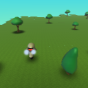

[Home](..)/[Resources](.)/Single Session Introduction for PC and Xbox Controller

## Single Session Introduction for PC and Xbox Controller
 

* [Module: Single Session Introduction](3_Kodu_Curriculum_Single_Session_Intro.pdf)
* Student Ages: 9-14 years old
* Activity Time: 60 minutes
* Activity Level: Beginner Coder

### Prerequisites 
* Download and Installation of Kodu

### Learning Objectives
* Navigate menus in Kodu
* Access the programming mode of Kodu, potentially adjusting simple code for a specific purpose
* Change and create a Kodu environment.
* Use tiles for setting and the development of tone and mood of game world.
* Create and alter landscape using various land editing tools.
* Add object, change color, select object, create sequential program for object.

### Contents
* [Single Session Introduction](3_Kodu_Curriculum_Single_Session_Intro.pdf)
* [Kodu Curriculum Appendix](Kodu_Curriculum_Appendix.pdf)
* [Complete Demo: Cycle and Trees (Cycle always wanders and avoids trees)](https://worlds.kodugamelab.com/world/la0mN6apSEGGNGopgKY2Dg==)

### Student Activities
[Basic Navigation](3_Kodu_Curriculum_Single_Session_Intro.pdf#page=4) 
The students will log on to Kodu and learn about the game creation environment. 
*Subjects: Design Technology, Digital Literacy, 21st Century Learning Skills*

[Creating a Simple Program](3_Kodu_Curriculum_Single_Session_Intro.pdf#page=5) 
Students will navigate menus in Kodu. Students will access the programming mode of Kodu, potentially adjusting simple code for a specific purpose 
*Subjects: Design Technology, Digital Literacy, 21st Century Learning Skills*

[Student Activity 1: Eating Apples](3_Kodu_Curriculum_Single_Session_Intro.pdf#page=6) 
Students will add an object, change color, select object, create sequential program for an object. 
*Subjects: Design Technology, Digital Literacy, 21st Century Learning Skills*

[Editing Your World](3_Kodu_Curriculum_Single_Session_Intro.pdf#page=7) 
Students will change and create a Kodu enviornment. Students will use tiles for setting and the development of tone and mood of game world. 
*Subjects: Design Technology, Digital Literacy, 21st Century Learning Skills*

[Student Sheet Activity 2: Landscapes](3_Kodu_Curriculum_Single_Session_Intro.pdf#page=8) 
Students will create and alter landscape using various land editing tools. 
*Subjects: Design Technology, Digital Literacy, 21st Century Learning Skills*

[Appendix: Surveys](3_Kodu_Curriculum_Single_Session_Intro.pdf#page=9) 
Students will have an in-class exercise is handy to prime students with some idea of what it is like to program games in Kodu. 
*Subjects: Design Technology, Digital Literacy, 21st Century Learning Skills*

### Skills
Character,
Citizenship,
Collaboration,
Communication,
Creativity,
Critical Thinking,
Project Based Learning 