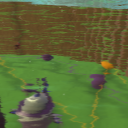

[Home](..)/[Resources](.)/State Machines

## State Machines
 

* [Lesson plan 5: State machines; Show Page As Color idiom](https://www.cs.cmu.edu/~dst/Kodu/Curriculum/modules/05/lesson5.pdf) 
* [Slides for module 5](https://www.cs.cmu.edu/~dst/Kodu/Curriculum/modules/05/slides5.pdf) as [PowerPoint source](https://www.cs.cmu.edu/~dst/Kodu/Curriculum/modules/05/slides5.pptx) 
* Student Ages: 9-14 years old
* Activity Time: 45-60 minutes
* Activity Level: Beginner Coder

### Prerequisites 
* Download and Installation of Kodu
* [Lesson 1: Eating apples](eating_apples)
* [Lesson 2: Color Filters](color_filters)
* [Lesson 3: Indentation and scores](indentation_and_scores)
* [Lesson 4: Rule Ordering](rule_ordering)

### Learning Objectives
* Learn how programs can comprise multiple pages.
* Learn how State machine diagrams are a helpful way to represent such complex programs.
* Learn that the states, which correspond to pages, are drawn as circles.
* Learn that transitions, which correspond to “switch to page” actions, are drawn as labeled arrows.

### Contents
* [Lesson plan 5: State machines; Show Page As Color idiom](https://www.cs.cmu.edu/~dst/Kodu/Curriculum/modules/05/lesson5.pdf) 
* [Slides for module 5](https://www.cs.cmu.edu/~dst/Kodu/Curriculum/modules/05/slides5.pdf) as [PowerPoint source](https://www.cs.cmu.edu/~dst/Kodu/Curriculum/modules/05/slides5.pptx) 
* [State1 exercise: A three-state state machine](https://www.cs.cmu.edu/~dst/Kodu/Curriculum/modules/05/05-state1.pdf)
* [Drawing States exercise: Translating rules to a state machine diagram; unreachable states](https://www.cs.cmu.edu/~dst/Kodu/Curriculum/modules/05/05-drawing.pdf)
* [CS Unplugged exercises: Simulating state machine execution](https://www.cs.cmu.edu/~dst/Kodu/Curriculum/modules/05/05-unplugged.pdf)
* [Assessment 5: Translating between rules and state machines; predicting behavior](https://www.cs.cmu.edu/~dst/Kodu/Curriculum/modules/05/questionnaire5.pdf)

### Student Activities
[State1 exercise: A three-state state machine](https://www.cs.cmu.edu/~dst/Kodu/Curriculum/modules/05/05-state1.pdf) 
Explore the Kodu World: "State1". Student will be playing cooperatively to observe how the character follows a path to reach the desired object: castle. Experiment with paths required to reach the desired object. Demonstrate the learning by developing a state machine with pseudo code. Then test the state machine solution with code in the world. Complete a journal activity to document and record any observations undertaken during the group activity. 
*Subjects:Math, Computer Science, Design Technology, Digital Literacy, 21st Century Learning Skills*

[Drawing States exercise: Translating rules to a state machine diagram; unreachable states](https://www.cs.cmu.edu/~dst/Kodu/Curriculum/modules/05/05-drawing.pdf) 
Student will be decoding cooperatively to draw the program as a state machine. Students will follow a path to reach the desired objects: tree, apple, and heart. Experiment with state machines required to the reach the desired objects. Demonstrate the learning by developing state machine with pseudo code. Then test the sate machine solution with code in the world. Complete a journal activity to document and record any experiments undertaken by the group. Complete a journal activity to document and record any observations during the group activity. 
*Subjects:Math, Computer Science, Design Technology, Digital Literacy, 21st Century Learning Skills*

[CS Unplugged exercises: Simulating state machine execution](https://www.cs.cmu.edu/~dst/Kodu/Curriculum/modules/05/05-unplugged.pdf) 
Explore the Kodu World: "Apple3". Student will be playing cooperatively to observe how the character follows a path to reach the desired objects: apples. Demonstrate the learning by developing a state machine with pseudo code. Then test the sate machine solution with the classroom unplugged activity. Complete a journal activity to document and record any observations during the group activity. 
*Subjects:Math, Computer Science, Design Technology, Digital Literacy, 21st Century Learning Skills*

### Performance Expectations
[Assessment 5: Translating between rules and state machines; predicting behavior](https://www.cs.cmu.edu/~dst/Kodu/Curriculum/modules/05/questionnaire5.pdf) Report an understanding of the following concepts: 

* Represent State machine diagrams.
* Represent states, which correspond to pages.
* Represent transitions in drawings.

### Skills
Character,
Citizenship,
Collaboration,
Communication,
Creativity,
Critical Thinking,
Project Based Learning

    