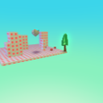

[Home](..)/[Resources](.)/Surface Area and Volume

## Surface Area and Volume
  

* [Lesson 4: Surface Area and Volume](6_Kodu_Curriculum_Math_Module.pdf#page=30)
* Student Ages: 8-14 years old
* Activity Time: 50 minutes 
* Activity Level: Beginner Coder

### Prerequisites
* Download and Installation of Kodu
* [Lesson 1: Growing Squares](growing_squares)
* [Lesson 2: Length, Width, Area, and Perimeter](length_width_area_and_perimeter)
* [Lesson 3: Area, Perimeter, and Volume](area_perimeter_and_volume)
* Lesson 4: Print Curriculum Guide:  
  * Student Activity: [Creating Shapes According to Specifications](6_Kodu_Curriculum_Math_Module.pdf#page=34) (1 per student)
* Lesson 4: Teacher Presentation Resource:
  * Complete Kodu World: [Flying Blimp](https://worlds.kodugamelab.com/world/adNUNlk_pEKJqDDbRoLMJQ==)  

### Learning Objectives
* Students will describe the change as a fraction of the original shape when given a change to a shape.
* Students will measure its length, width, and height using a coordinate plane when given a three-dimensional quadrilateral.
* Students will generalize and extend the pattern by using mental math techniques involving multiples of ten when calculating the surface area of a three-dimensional quadrilateral.
* Students will describe and calculate the effect the changes have on surface area, perimeter, and volume when given changes to the length and width of a quadrilateral.

### Contents
* [Activator](#activator)
* [Surface Area](#surface)
* Student Activity:
  * [Creating Shapes According to Specifications](#creating)
* Complete Kodu World: 
  * [Flying Blimp](<https://worlds.kodugamelab.com/world/adNUNlk_pEKJqDDbRoLMJQ==>)

### Student Activities

[**Activator**](6_Kodu_Curriculum_Math_Module.pdf#page=31) 
The teacher should display a single square block in Kodu. Students will respond to the guiding questions about area and surfaces of cubes. Students will learn that the surfaces combined is called surface area. Students will learn to examine surface area and how it is affected when a shape is divided.
*Subjects: Math, Computer Science, Digital Technology, Engineering, 21st Century Learning*

[**Surface Area**](6_Kodu_Curriculum_Math_Module.pdf#page=31) 
Students will create a 1 x 1 x 8 (L x W x H) tower in a new world. Students will to calculate the surface area of a Kodu tower. Students will create an irregular shape and calculate the surface area again. Students will give definitions for surface area in their own words. Students will create shapes with certain lengths, widths, and heights. Students will also create shapes with specified surface areas and volumes as well as decide the length, width, and heights themselves, so the resulting shapes will vary. Students will learn to program a flying character to move and drop objects.
*Subjects: Subjects: Math, Computer Science, Digital Technology, Engineering, 21st Century Learning*

### Performance Expectations

[**Creating Shapes According to Specifications**]() 
Students will work with a clock buddy for this assignment and use pair programming rules to cooperate with one another. Students will use the specific Kodu building block materials. Students will calculate some of the shape's properties. Students will print out pictures of their shapes when they are done. Students will experiment with the world by adding trees, clouds, and programming the object to perform actions.

### Skills
Character,
Citizenship,
Collaboration,
Communication,
Creativity,
Critical Thinking,
Project Based Learning
