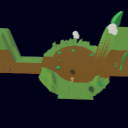

[Home](..)/[Resources](.)/Water Connects Us All

## Water Connects Us All
  

* [Lesson 2: Remix: Water connects us all](water_all_around_us.pdf#page=4)
* Student Ages: 10-14 years old
* Activity Time: 1 day (60 minutes) 
* Activity Level: Beginner Coder

Description: Lesson 2 presents students with a game world that reframes what they learned in lesson 1 and this time lets players observe a model representing how waterways connect underwater populations (in this case Salmon on their way to the ocean), with other populations, as well as with human beings. The game world gives students the baseline for a game they can complete by remixing the different level components. Using Kodu, they can take advantage of the characters provided (and the behaviors they have in them), to create their own salmon run game.

### Prerequisites
* Download and Installation of Kodu
* [Lesson 1: Play Connects Us All](water_all_around_us)

### Learning Objectives
* Observe and experiment with a computer model, and create hypotheses, of the relationships between waterways, salmon, other animals, and human activity.
* Construct a student run simulation from a base template.

### Contents
* [Lesson 2: Remix: Water connects us all](water_all_around_us.pdf#page=7)
* [Tutorial World:Water connects us all (baseline)](https://worlds.kodugamelab.com/world/fbdyJ64suEmzMmNMo8cg2g==)

### Student Activities
[Activator](water_all_around_us.pdf#page=8) 
Students will discuss prior knowledge on the lifecyle of salmon. Students will have a discussion about the sort of ecosystem salmon fry have to live in as they move out of their spawning grounds and toward the ocean. Students will have a discussion about how salmon fry use waterways and water bodies with different current speeds to survive on their way to the ocean. Students will have a discussion about how camouflage help salmon avoid predators in different water bodies. Students will discussion how man’s activity connected to water quality in the salmon’s journey to the ocean. Students will discuss how waterways help or hinder the predators of salmon. Students will discuss in what ways water currents and levels connect a salmon to its predators at different stages. 
*Subjects:Science, Computer Science, Engineering, 21st Century Learning*

[Guided Discovery: Water connects predators and prey below and above the surface](water_all_around_us.pdf#page=8) 
Students should read the Salmon Fry Handout. The article describes the factors involved in a fry’s survival on its journey downstream to the ocean. Students will explore a Kodu level that shows some of the awesome ways in which waterways both help and challenge the survival of a young salmon on its way to the ocean. Students will learn how to build this level, and how the relationships between salmon and water can be modeled using Kodu. Students will form pairs and take turns at playing Water connects us all, where they take the role of a cybersalmon fry making its way from the spawning grounds where it was born down to the ocean to lead an adult life. The kodu world is a mini game that brings up ideas of how water bodies and water currents connect underwater populations, animals, and human activity. 
*Subjects:Science, Computer Science, Engineering, 21st Century Learning*

[Creating your own salmon journey level](water_all_around_us.pdf#page=9) 
Students will learn to create their own version of the game they just played, and in the process learn how to use Kodu to model the interactions in the waterways salmon travel. Students will build the level by constructing three main sections or stages, organized from south to north as described in the following sections. 
*Subjects:Science, Computer Science, Engineering, 21st Century Learning*

[Stage 1: The Swift River](water_all_around_us.pdf#page=10) 
Students will build a high speed waterway which could be found in a waterway salmon must travel on their way to the ocean.   
*Subjects:Science, Computer Science, Engineering, 21st Century Learning*

[Stage 2: The Calm Pool](water_all_around_us.pdf#page=14) 
Students will program the game so that if players they survive the stream, the game will be taken into the second type of waterway important to salmon fry, the calm pool. 
*Subjects:Science, Computer Science, Engineering, 21st Century Learning*

[Stage 3: The polluted stream and game end](water_all_around_us.pdf#page=16) 
Students will program the food in the pool gets dragged downstream by the current. Students will program the fry (now a bigger fish if players had it eat some food) will float downstream to the last stage of the game.   
*Subjects:Science, Computer Science, Engineering, 21st Century Learning*

### Performance Expectations 
[Lesson Project: Remix your own waterway game](water_all_around_us.pdf#page=18) 
Students will remix their own Kodu level. The goal of the project is to make the game more fun while trying to keep the basic principles of a salmon’s life represented in it, or by adding other mechanics that show the connection between animals, waterways, or human activity. Students can add or remove characters, and change their positions or their programming in order to achieve the project’s goals.  
*Subjects:Science, Computer Science, Engineering, 21st Century Learning*

### Skills
Character,
Citizenship,
Collaboration,
Communication,
Creativity,
Critical Thinking,
Project Based Learning